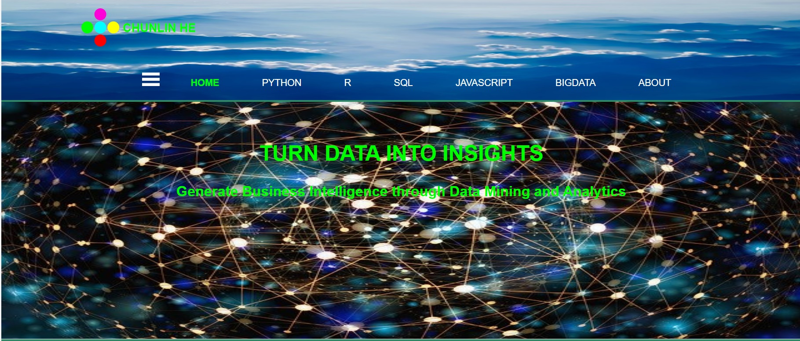

## Welcome to My GitHub: DATA SCIENCE

(https://datute.net/)

## Data science
"Data science is an interdisciplinary field that uses scientific methods, processes, algorithms and systems to extract knowledge and insights from data in various forms, both structured and unstructured."

"Data science is a 'concept to unify statistics, data analysis, machine learning and their related methods' in order to 'understand and analyze actual phenomena' with data. It employs techniques and theories drawn from many fields within the context of mathematics, statistics, information science, and computer science." -- Wikipedia (November 13, 2018)

## Big data

The term “big data” was first corned in 1997 by the NASA astronomers Michael Cox and David Ellsworth regarding the big quantity of information generated by the supercomputers, which was published in the Proceedings of the IEEE 8th Conference entitled “Application-controlled demand paging for out-of-core visualization” from the ACM digital library.

"Big data is high-volume, high-velocity and/or high-variety information assets that demand cost-effective, innovative forms of information processing that enable enhanced insight, decision making, and process automation." -- Gartner (2012)

Accordingly, big data have three defining properties/dimensions including (1) <strong>volume</strong> (quantity), (2) <strong>variety</strong> (types: structured, semi-structured and unstructured) and (3) <strong>velocity</strong> (streaming data with speed). The variety of big data implies any of the following types:

<li><b>Structured data:</b> RDBMS data, easily retrieved through SQL.</li>
<li><b>Semi-structured data:</b> data in files (xml, json docs, NoSQL database).</li>
<li><b>Unstructured data:</b> images, videos, text files etc.</li>

## Data Analytics
Data processing and analytics include building and training machine learning models, manipulating data with technology, extracting information from data as well as building data tools, applications, and services. It may consist of the following major steps (Big Data Science & Analytics, 2016):

<li>Framing the problem</li>
<li>Data acquisition for the problem</li>
<li>Data wrangling</li>
<li>Machine learning</li>
<li>Developing a statistical/mathematical model</li>
<li>Data visualization</li>
<li>Communicating the output of the analysis: (1) data report, and (2) data products.</li>
